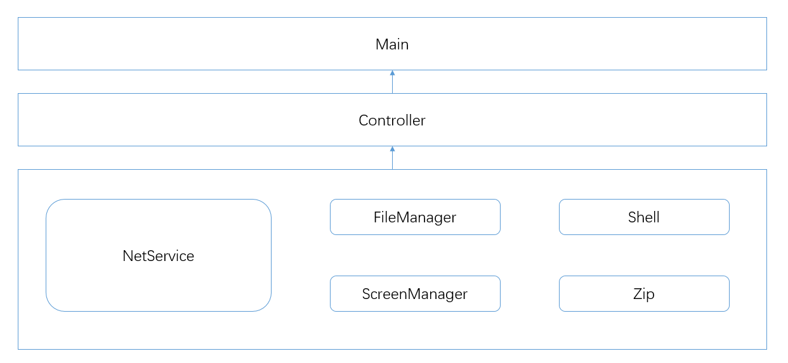
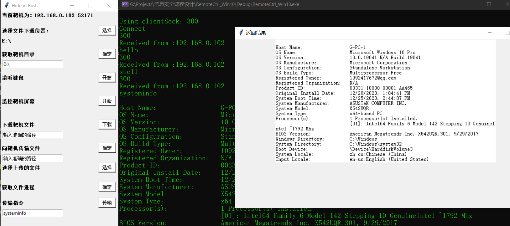

#### 一个简简单单的远控程序

##### 1. 关于本程序

* 使用C++实现了远控功能（服务端；Socket收发数据、文件的遍历上传下载删除、远程的shell命令执行、屏幕监控、键盘监控、进程遍历等）
* 使用python实现了远控的客户端（与主程序建立连接、发指令、上传下载文件等）
* 服务端有主动连接和被动连接两种模式；服务端可以隐藏exe程序运行时的黑窗口（默认不开启）；服务端可以修改注册表启动项以实现开机自启（默认不开启）。

##### 2. 程序架构设计

* 程序服务端分为三层架构。最底层是各个功能模块，实现socket通信、文件操作等功能；中间层使用一个抽象类Controller将所有功能模块封装起来，提供给主函数使用；最上层主函数只与Controller层进行交互，便于功能的扩展。
* 

##### 3. 程序运行示例

* 在示例中，服务端使用主动模式运行，主动向客户端发起连接；客户端输入一条shell指令，让服务端远程执行并返回结果。
* 

##### 4. 程序存在的不足

* 由于时间紧张和开发时的分工问题，本程序目前最大的不足是没有实现一些较为进阶的功能（如基于消息钩子的进程隐藏、运行时自动提权等）。
* 由于开发时的分工问题，本程序的部分功能模块目前还停留在直接调用外部的exe程序上，即有些功能模块没有融入我们的架构中，日后有时间可以进行整理。

