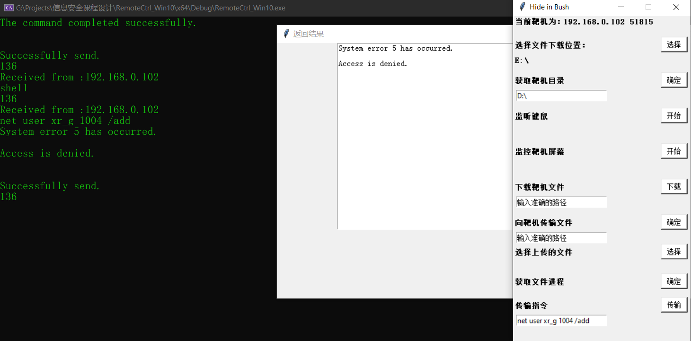
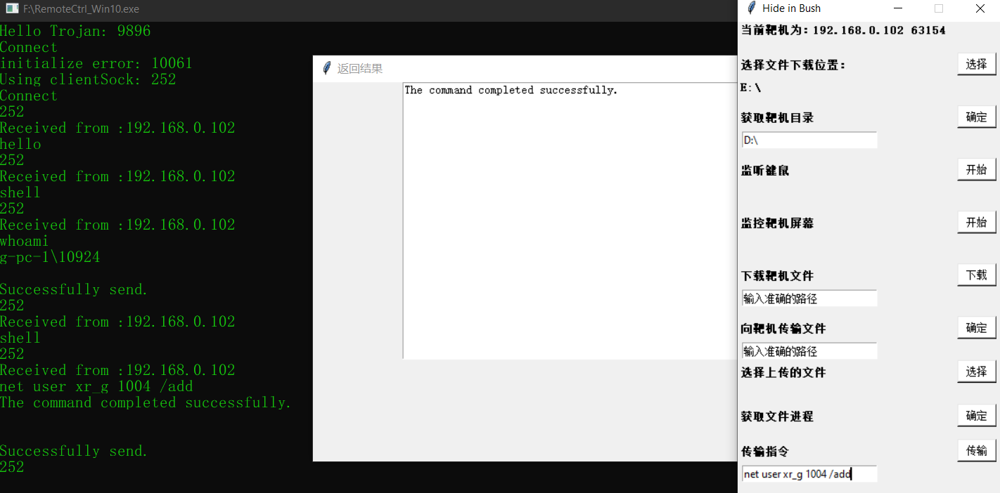

#### 一个简简单单的远控程序

##### 1. 关于本程序

* 使用C++实现了远控功能（服务端；Socket收发数据、文件的遍历上传下载删除、远程的shell命令执行、屏幕监控、键盘监控、进程遍历等）
* 使用python实现了远控的客户端（与主程序建立连接、发指令、上传下载文件等）
* 服务端有主动连接和被动连接两种模式；服务端可以隐藏exe程序运行时的黑窗口（默认不开启）；服务端可以修改注册表启动项以实现开机自启（默认不开启）。

##### 2. 程序架构设计

* 程序服务端分为三层架构。最底层是各个功能模块，实现socket通信、文件操作等功能；中间层使用一个抽象类Controller将所有功能模块封装起来，提供给主函数使用；最上层主函数只与Controller层进行交互，便于功能的扩展。
* 

##### 3. 程序运行示例

* 在示例中，服务端使用主动模式运行，主动向客户端发起连接；客户端输入一条shell指令，让服务端远程执行并返回结果。
* 

##### 4. 程序存在的不足

* 由于时间紧张和开发时的分工问题，本程序目前最大的不足是没有实现一些较为进阶的功能（如基于消息钩子的进程隐藏、运行时自动提权等）。
* 由于开发时的分工问题，本程序的部分功能模块目前还停留在直接调用外部的exe程序上，即有些功能模块没有融入我们的架构中，日后有时间可以进行整理。

---

#### 2020-12-18更新

##### 1. 更新简介

* 增加提权功能；
* 增加进程隐藏代码（逻辑没有问题，实际测试时任务管理器闪退，无法完成进程隐藏效果）
* 重新构造本仓库结构。`src`路径中包含客户端和服务端源码，`src/server`中包含控制程序源码、提权程序源码和隐藏程序示例。

##### 2. 更新详述

* 提权功能

  * 实现了基于COM组件提升名称的提权运行。首先运行Launcher.exe程序，该程序将运行rundll32.exe，使其加载BypassUAC.dll并以管理员权限打开远控程序RemoteCtrl_Win10.exe。
  * 运行示例：
  * 
  * 

* 进程隐藏

  * 基于Ring3级的消息Hook，修改ZwQuerySystemInformation，将结果中的特定程序解链。代码逻辑没有问题，在测试时已经证明了Hook之后的API能够得到运行，然而程序运行后任务管理器不断闪退，目前没有找到一个很好的解释。基于此，仅给出代码作为示例，没有将其整合入远控程序中。

  